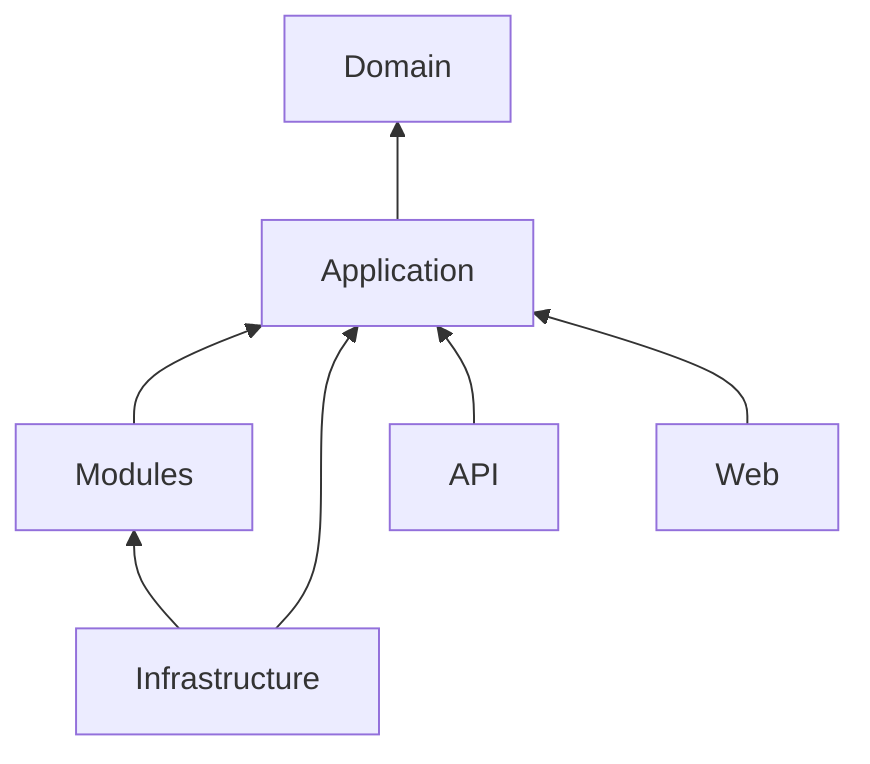

# XMS

XMS (`eXtensible Management System`) - модульная система управления на предприятии и интеграциями с внешними сервисами. 
Решение состоит из двух entrypoint-приложений:

- `XMS.Web` - Blazor Server интерфейс для работы пользователей.
- `XMS.Api` - HTTP API для интеграций, внешних вызовов и технических операций синхронизации.

Проект собирается вокруг общей доменной модели, инфраструктурного слоя на EF Core и набора подключаемых модулей.

## Состав решения

В `XMS.slnx` сейчас подключены следующие проекты:

- `XMS.Web` - UI на Blazor Server + MudBlazor.
- `XMS.Api` - minimal API + OpenAPI/Scalar.
- `XMS.Application` - прикладной слой, внутри которого теперь лежат папки `Core`, `EventBus` и `Integration`.
- `XMS.Domain` - доменные сущности.
- `XMS.Infrastructure` - ApplicationDbContext, EF Core, Serilog, OpenTelemetry, RabbitMQ event bus.
- `XMS.Modules` - прикладные модули. Сейчас в решении есть как минимум `CostModule` и `GodooModule`.

## Стек

- `.NET 10`
- `ASP.NET Core`
- `Blazor Server`
- `MudBlazor`
- `Entity Framework Core` + `SQL Server`
- `ASP.NET Core Identity`
- `Serilog` + `Seq`
- `OpenTelemetry`
- `RabbitMQ`

## Архитектура



Что важно понимать:

- `XMS.Web` и `XMS.Api` подключают одни и те же application/modules слои.
- `XMS.Infrastructure` регистрирует БД, телеметрию и event bus.
- интеграции с 1C/AD/Bitrix теперь физически находятся внутри `XMS.Application/Integration`.
- `XMS.Modules` расширяет систему бизнес-модулями и своими endpoint'ами.

## Требования

Для локального запуска понадобятся:

1. `.NET SDK 10.0`
2. `SQL Server`
3. `RabbitMQ`, если вы используете сценарии с очередями и уведомлениями
4. `Seq` или другой доступный endpoint для логирования/OTLP, если хотите видеть observability локально
5. доступные интеграционные endpoint'ы или тестовые заглушки для 1C, AD, Bitrix, Yunu

## Конфигурация

В проекте используются:

- `appsettings.json`
- `appsettings.Development.json`
- User Secrets
- переменные окружения

Минимум для старта - рабочая строка подключения:

```json
{
  "ConnectionStrings": {
    "DefaultConnection": "Server=localhost;Database=XMS;User Id=sa;Password=Strong_password_123;TrustServerCertificate=true"
  }
}
```

Рекомендуемый подход:

- строки подключения, пароли, API keys и service credentials хранить вне репозитория;
- для локальной разработки использовать User Secrets;
- для CI/CD и контейнеров использовать переменные окружения или внешний secret store.

Основные секции конфигурации, которые реально используются в решении:

- `ConnectionStrings:DefaultConnection`
- `Serilog`
- `RabbitMqConfig`
- `BuhClientConfig`
- `ZupClientConfig`
- `UtClientConfig`
- `AdClientConfig`
- `BitrixClientConfig`
- `GodooBuhClientConfig`
- `YunuClientConfig`
- `ApiKeys` - только для `XMS.Api`

## Миграции БД

Миграции находятся в [XMS.Infrastructure/Data/Migrations](/D:/Source/Repos/XMS/XMS.Infrastructure/Data/Migrations).

Применение миграций:

```bash
dotnet ef database update --project XMS.Infrastructure --startup-project XMS.Web
```

Если стартовым проектом выступает API:

```bash
dotnet ef database update --project XMS.Infrastructure --startup-project XMS.Api
```

## Локальный запуск

### Web

```bash
dotnet run --project XMS.Web
```

Профили запуска из [launchSettings.json](/D:/Source/Repos/XMS/XMS.Web/Properties/launchSettings.json):

- `http://localhost:5101`
- `https://localhost:7012`

### API

```bash
dotnet run --project XMS.Api
```

Профили запуска из [launchSettings.json](/D:/Source/Repos/XMS/XMS.Api/Properties/launchSettings.json):

- `http://localhost:5152`
- `https://localhost:7243`

В API также подключены OpenAPI и Scalar UI.

## Что есть в API

В решении уже присутствуют endpoint'ы нескольких групп:

- application endpoint'ы из `XMS.Application`
- integration endpoint'ы для 1C UT
- module endpoint'ы из `GodooModule`

Примеры существующих маршрутов:

- `PUT /api/godoo/marketplace-relations/reload/godoo`
- `PUT /api/godoo/marketplace-relations/reload/ip`
- `GET /integration/yunu/article-relations/godoo`
- `GET /integration/yunu/article-relations/ip`
- `GET /api/1c/ut/catalog-номенклатура/{refKey}`
- `PUT /ext/1c/ut/catalog-номенклатура/resync`
- `GET /api/1c/ut/document-заказ-клиента`
- `PUT /ext/1c/ut/document-заказ-клиента/resync`

Полный список лучше смотреть через OpenAPI/Scalar после запуска `XMS.Api`.

## Docker

Для `XMS.Web` и `XMS.Api` в репозитории есть отдельные Dockerfile:

- [XMS.Web/Dockerfile](/D:/Source/Repos/XMS/XMS.Web/Dockerfile)
- [XMS.Api/Dockerfile](/D:/Source/Repos/XMS/XMS.Api/Dockerfile)

Базовые команды сборки:

```bash
docker build -t xms-web -f XMS.Web/Dockerfile .
docker build -t xms-api -f XMS.Api/Dockerfile .
```

Перед использованием контейнерной сборки стоит убедиться, что Dockerfile синхронизирован с реальным графом project references.

## Примеры пользовательского интерфейса


